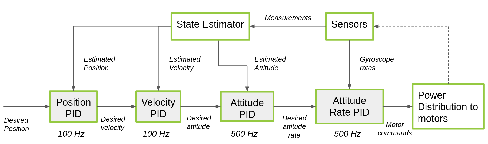

# crazy_common_py
## crazy_common_py
This module collects all classes, data types, exc. shared among all other modules.
### common_functions.py
As its name suggests, it contains all commonly used defined functions.
### constants.py
This script contains all constants definitions, for example:
* polynomial fitting coefficients to map motor's input command into rotating speed, thrust, exc.;
* constraint values for PIDs within simulated flight controller: maximum speed, maximum attitude, exc.;
* default values: takeoff height, velocity during takeoff, exc.;
* all  values for PIDs in flight controller;

### controllers.py
This script contains different classes definitions related to different types of controllers, like:
* PidController;

### dataTypes.py
This script contains different data types definitions.

### LaunchFileGenerator.py
This script contains the definition of class *LaunchFileGenerator* which is used to interpreter a txt file (located at 
../crazyCmd/data/input/launc_info), giving instructions about the simulation one wants to set up; then the class 
accordingly generate a launch file.

## crazyflie_drone
This module collects all classes used to handle a real crazyflie.

### CrazyDrone.py
This script contains the definition of *CrazyDrone* class, used to set up all topics, actions and services used to 
handle the real crazyflie.

## crazyflie_manager
This module contains all classes used as a bridge between real and simulated crazyflies; basically it's able to handle 
both a simulated and real crazyflie, properly setting up all topics, actions and services.

### CrazyAppManager.py (WIP)
This script contains the definition of the GUI application to control real/simulated crazyflie.

### CrazyManager.py (WIP)
This script contains the definition of all classes used to control one real/simulated crazyflie.

### SwarmMaganer.py (WIP)
This script contains the definition of all classes used to control one swarm of real/simulated crazyflies.

## crazyflie_simulator
This module collects all classes used to simulate one crazyflie.

### CrazySim.py
This script contains the definition of *CrazySim* class, which is used to spawn one simulated crazyflie within Gazebo 
simulation. The spawn is done using roslaunch Python library, instead of using traditional *.launc file*; using this 
library may be not that efficient, that's why probably this spawning method will be changed.   
The class performs different operations:
* reads the reference crazyflie *urdf file*, modifies some parameters (like robot name space, sensors noise, exc.) using default values (constants.py);
* creates *rosparameters* used by *VelocityJointControllers* to control the simulated propellers rotating speed;
* spawns the defined crazyflie calling a Gazebo service;
* starts Gazebo's *VelocityJointControllers*;
* instantiates:
  * **StateEstimatorSim:** used to estimate the state of the simulated crazyflie;
  * **MotionCommanderSim:** used to set up all the framework (topics, actions and services) used to command the virtual crazyflie;

### filters.py
This script contains the re-definition of some filters used within Crazyflie's firmware.

### FlightControllerSimCustom.py
This script contains the definition of the used simulated flight controller, basically it's a re-definition of the 
PIDs cascade defined in the real Crazyflie's firmware.  

For further details see the code or [Bitcraze's webpage](https://www.bitcraze.io/documentation/repository/crazyflie-firmware/master/functional-areas/sensor-to-control/controllers/).

## crazyflie_swarm
WIP